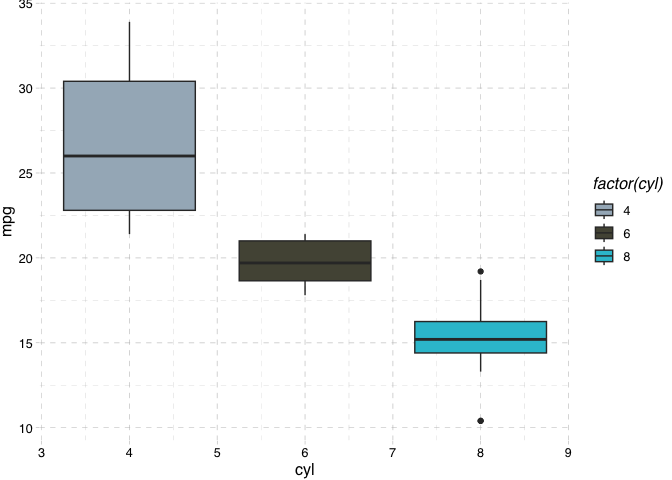

<!-- README.md is generated from README.Rmd. Please edit that file -->

# nordicnoir

<!-- badges: start -->
<!-- badges: end -->

The goal of nordicnoir is to provide a color palette for ggplot2 that’s
inspired by Nordic Noir tv series.

## Installation

You can install the development version of nordicnoir from
[GitHub](https://github.com/) with:

``` r
# install.packages("devtools")
devtools::install_github("taylorrodgers/nordic_noir")
```

## Example

This shows how you can use the respective functions within the
nordicnoir package.

``` r
library(nordicnoir)
library(ggplot2)

ggplot(mtcars, aes(x = cyl, y = mpg, fill = factor(cyl))) +
  geom_boxplot() +
  nordic_fill_manual() +
  ggthemes::theme_pander()
```


